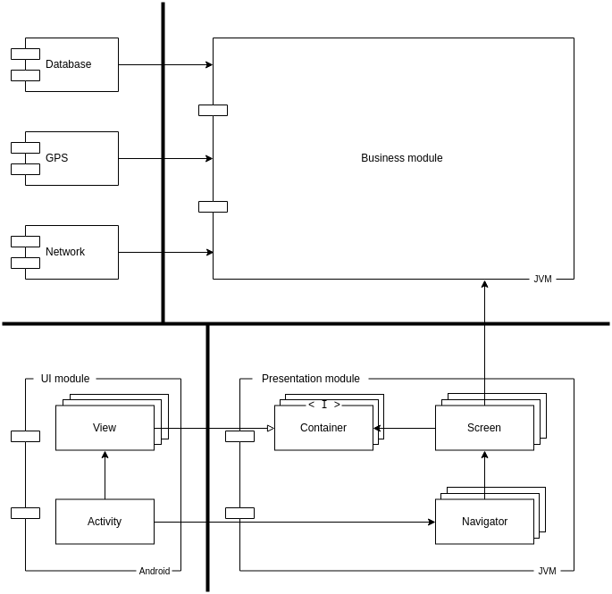

# Application Architecture

The latest trend in Android application development is 'Clean Architecture',
where developers use all sorts of 'Model-View-Presenter',
'Model-ViewModel-Presenter' or 'Model-View-Intent' "architectures" to develop
their Android apps.
Databases are abstracted away behind repositories, but still a lot of business
logic resides in the presentation layer of the application.

<!--Android's presentation layer however is riddled with classes that do way too -->
<!--much, and make it quite hard to properly apply separation of concerns.-->

Clean Architecture is more than that.
It is about having your business rules at the center of your application:
they are the most important things to your software.
Business rules that have nothing to do with lifecycles, Views or state
restoration.
Business rules that can be tested on a JVM without ever having to spin
up an Android system.

Architecture is about carefully defining boundaries between components
in your application to protect them from the details.
The database is such a detail, but also any location providers, REST
api's, and yes, the presentation and UI layer.
The presentation layer here is concerned with navigation, the Activity
lifecycle and with binding the business rules to the UI layer.
The UI layer again is a detail to the presentation layer.

In the Android framework everything in the presentation layer is tightly
coupled: the lifecycle, navigation and UI management are all handled by
the Activity or the Fragment.

Acorn provides a way to actually decouple these concerns by introducing
clear boundaries between the UI, presentation and navigation on top of
your business rules, while still providing full control over state
restoration, transition animations and lifecycles.

_Separation of concerns. Notice how all arrows point toward the business
rules._
